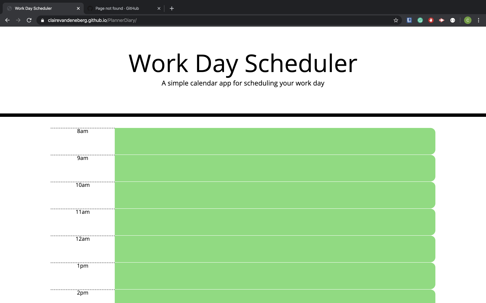

# PlannerDiary

Test my code [here](https://clairevandeneberg.github.io/PlannerDiary/)

Aimple calendar application that allows the user to save events for each hour of the day. This app will run in the browser and feature dynamically updated HTML and CSS powered by jQuery. Used Moment.js library to work with date and time.

Screenshot

Made with JS, HTML, CSS, Moment.js, JQuery by Claire Vandenberg, 2020